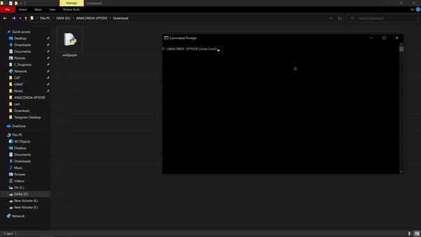

# automated-wallpaper-downloader

This is a script to download all the highest resolution wallpapers available (maximum 20). The user can choose the theme for the wallpapers. The script will create a new folder automatically for different themes and store them seperately.

----------------------------------------
## Before Scripting

Without this, A user has to perform the following steps in order to download and store the wallpapers of his desired theme:

1. Open a web browser

2. Open the www.hdwallpapers.in website

3. Search for the desired theme

4. Open a wallpaper thumbnail

5. Download the highest resolution available

6. Go back to the search result page

7. Repeat until all wallpapers are downloaded

8. Go to the local storage and cut and paste them to a desired folder

-----------------------------------
## After Scripting

By running this program, we can automate the entire process. A couple of command line arguments will automatically download the highest resolution wallpapers and create a folder on the locally and store them.

